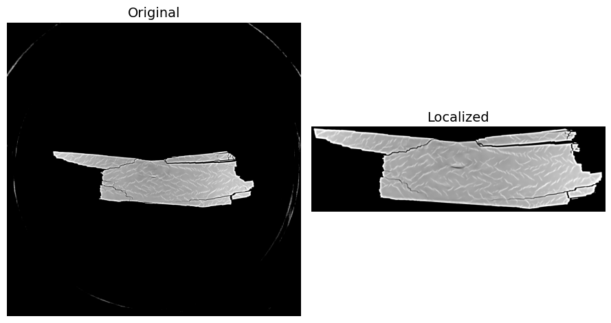

# Real Time Sample Localization for Computed Tomography  

## Overview    
This project provides a sample localization method for tomography volumes using an unsupervised foreground detection approach. This benefits volumes that
contain a large amount of background regions, relative to the sample, that can be safely trimmed away providing multiple benefits: 
<ol>
    <li>Reduced disk space for storage</li>
    <li>Improved data transfer rates</li>
    <li>Easier user engagement</li>
    <li>Improved performance and reduced training time for AI/ML tasks</li>
</ol>

This is done based on the following core steps:
<ol>
    <li>Volume pre-processing</li>
    <li>Sample detection via thresholding</li>
    <li>Binary mask cleanup</li>
    <li>Bounding box generations</li>
</ol>

Finally, this method provides two key optimizations (not-enforced) to enable real time performance:
-   Parallelization across multiple CPUs
-   Proxy volume generation via down-sampling

## Installation   

``` bash
git clone https://github.com/AISDC/LOCATOR-CT localize
cd localize
conda env create -f envs/localize_environment.yml
conda activate localize
pip install .
```

Dependencies include:

-   tifffile
-   tqdm
-   pyyaml
-   scikit-image
-   scikit-learn
-   scipy

## Assumptions    
-Assumes reconstructed volume is saved as a directory of .tif/.tiff images.     
-Images are noise free to the extent that thresholding can accurately identify the core structure of the sample.     

## Project Structure    
    localize/
    ├── localize/
    │   ├── main.py                # CLI driver that reads, localizes, and saves data
    │   ├── preprocess.py          # pre-process volume for localization
    │   ├── threshold.py           # sample detection via thresholding
    │   ├── morph_cleanup.py       # binary mask cleanup 
    │   ├── union_bbox.py          # bounding box generation and union 
    │   ├── refine_bbox.py         # bounding box refinement and add margin 
    │   ├── sample_localization.py # combines all steps to localize sample
    │   ├── shmarray.py            # parallel processing setup and utilities
    │   ├── tiffs.py               # TIFF I/O utilities
    ├── docs/                
    │   └── source/img/      # workflow and example figures


## Methodology 

### Volume Pre-Processing
Pre-processing contains four steps
<ol>
  <li>Down-Sample</li>
    <ul>
        <li>To alleviate  the high-computational cost associated with large-scale 3D data processing, we enable working with a down-sampled volume using local-mean. While reducing each dimension of the volume by 2 has marginal impact on sample resolution, it reduces data size by 2<sup>3</sup>. This can be extended such that down-sampling each dimension by a factor of <i><b>ds</b></i>, the volume is reduced by <i><b>ds</b></i><sup>3</sup>.</li> 
        <li>Down-sampling factor is controlled in the config file via ds_z, ds_y, ds_x.</li>
        <li><i><b>Note that this step is not required but provides a substantial speedup (key factor enabling real-time performance).</b></i></li>
    </ul>
  <li>Clip and Rescale</li>
    <ul>
        <li>Clip the bottom/upper percentiles of the volume and rescales full volume to 0-1 which helps in stabilizing  sample detection (step 2)</li>
        <li>Controlled in config via p_low/p_high. Default is 15.0/85.0 which has proven to be robust</li>
        <li><i><b>This step is required</b></i></li>
    </ul>
  <li>Circle Crop</li>
    <ul>
        <li>Some samples are contained within a cylindrical apparatus with cross-sections presenting the sample contained in a circle. Therefore, we can crop the outer circle, determined by the edge radius to center away to facilitate sample detection (step 2).</li>
        <li>Controlled in config via circle_crop</li>
        <li><i><b>This step is not required</b></i></li>
    </ul>
  <li>Morphological Reconstruction</li>
    <ul>
        <li>In stage 2, initial sample detection is done via thresholding based on Otsu/GMM with a key assumption being that there is sufficient contrast between foreground/background. In CT, the sample is the foreground and the background is often air. When working with high-energy and/or low absorption material(s), the difference in contrast is often negligible making thresholding extremely difficult. To improve the separation, morphological reconstruction, via skimage, is used to enhance the foreground. However, this comes at a significant increase in computational costs which can be alleviated by parallelizing the step across CPUs as it operates independently on slices. </li>
        <li>Example can be found <a href="https://scikit-image.org/docs/stable/auto_examples/color_exposure/plot_regional_maxima.html">here</a></li>
        <li><i><b>This step is required</b></i></li>
    </ul>
</ol>


### Sample Detection via Thresholding
Sample detection can be done using either Otsu or Gaussian Mixture Model (GMM). However, GMM is significantly slower and not recommended. For Otsu, a single threshold based on the full volume is generated rather than one threshold for each slice. This ensures consistency across the volume. From there, a binary mask is generated. 


### Binary Mask Cleanup
This step removes any small noisy pixels (islands) and dilates to fill small gaps from the masks generated in stage 2 done using scipy and skimage. 

### Bounding Box Generation 
This step generates the slice-wise bounding boxes using the following steps:
<ol>
  <li>Generation</li>
    <ul>
        <li>For each slice, determine if any foreground/sample pixels exist.</li>
        <li>If foreground exists, the smallest 2D rectangle enclosing the pixels is found.</li>
    </ul>
  <li>Union</li>
    <ul>
        <li>After all slices are processed, the per-slice rectangles are merged into a single 3D cuboid producing the smallest cuboid that contains all sample pixels.</li>
    </ul>
  <li>Refinement</li>
    <ul>
        <li>To reduce any residual noise or threshold artifacts, the cuboid is refined using connected components with 26-connectivity focusing on face + edge + corner neighbors ensuring the cuboid only focuses on the dominate sample.</li>
    </ul>
</ol>

### Proxy to Full Mapping
Detected cuboid is potentially computed using the down-sampled volume from stage 1. If so, it is then mapped back to the original sized volume using the given down-sampling factors with the option to have a small margin in each dimension via the margin parameter in the config file.  


## Getting Started    
### Example call

```bash
python main.py --n_cpus=12 --config=path_to_config/config.yaml --in_tiff_dir=/path_to_reconstruction --out_tiff_dir=/path_to_save_cropped_reconstruction
```
The file produces information regarding data loading/saving via a progress bar and reports how long the localization method took. However, it does not provide status/details on each step.  

## Localization Example
<p align="center">
  
</p>


## Contributing    
Contributions are welcomed! Always looking for additional ways to optimize the code!
